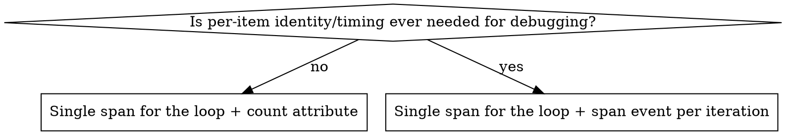

# Tracing hygiene patterns (Go / OpenTelemetry)

## Pattern 1: span created inside a loop

**Symptom:** `tracer.Start(...)` (or equivalent) called once per loop iteration —
per block, per shard, per record, per retry. A tenant/request with a lot of
items turns one trace into hundreds or thousands of spans, which is unusable
to query or view. See Tempo's own instrumentation best practices: "adding a
span for each method or function call in that loop might... produce hundreds
or thousands of worthless spans."

**Real example** (`grafana/tempo`, `modules/livestore/instance_search.go`,
`iterateBlocks`): a span was started inside `go func(block common.WALBlock) {
... tracer.Start(ctx, "process.walBlock") ...}` for every wal block and every
complete block in a tenant's block list.

**Not just literal loops.** The same explosion happens one call-graph hop
away from the loop: a function invoked once per iteration through a
callback the loop hands out (e.g. `iterateBlocks(ctx, start, end, fn)` where
`fn` starts its own span) matches this pattern just as much as a `tracer.Start`
written directly inside the `for` body. Grepping for `tracer.Start` textually
inside `for`/`range` will miss these — also check what the loop's callback
parameter does, and what *its* callers pass in.

### Correctness gate — check this BEFORE collapsing, not after

A per-iteration span's `ctx` can be consumed by more than just its own
`span.End()`. Before removing it, grep the surrounding code (and anything
reachable through the `ctx` passed into the loop body) for:

- `trace.SpanFromContext(ctx)` — another goroutine or downstream call may be
  writing attributes onto *whatever span is currently active on that ctx*.
  If you collapse the per-iteration span, concurrent iterations start
  sharing one parent span for that write, which is a correctness/attribution
  regression, not just a shape change.
- A nested `tracer.Start(ctx, ...)` inside the loop body or a function it
  calls — collapsing the outer span reparents that child span onto the
  loop's parent span instead of the (now-removed) per-iteration span,
  changing the trace structure that other code or dashboards may depend on.

If either is true, **do not collapse the span** — this looks like "just
tracing" but changes real behavior. Skip and flag it for a separate,
deliberate design decision instead. (This is exactly what happened
re-running this pattern against `iterateBlocks` for real: `process.walBlock`
and `process.completeBlock` both failed this gate — `SearchTagValuesV2`'s
cache path reads `SpanFromContext` on that same `ctx`, and `QueryRange`'s
per-block callback starts a nested span on it — so both were left in place
with only the Pattern 2 fix applied.)

### Decision: what replaces the per-iteration span?



- **No per-item value** (the loop body is uniform, failures are already
  attributed via a wrapped error): collapse to one span around the loop,
  record only a count attribute (e.g. `attribute.Int("blocksProcessed", n)`).
- **Per-item value still matters** (you'd otherwise want to see which item,
  and roughly when, within the loop): keep one span around the loop, but
  replace each per-iteration span with `span.AddEvent("processed block",
  trace.WithAttributes(attribute.String("blockID", meta.BlockID.String())))`.
  Events are timestamped and queryable (`{ event:name = "processed block" }`,
  `{ event.blockID = "..." }`) without the overhead of a full child span.

Do not silently default to the count-only version when the per-item ID was
being used for anything (error attribution, latency-outlier hunting) — check
how the removed span's attributes were actually consumed before dropping
them.

### Before / after

```go
// before
for _, b := range snap.walBlocks {
    ...
    go func(block common.WALBlock) {
        ctx, span := tracer.Start(ctx, "process.walBlock")
        span.SetAttributes(attribute.String("blockID", meta.BlockID.String()))
        defer span.End()
        if err := fn(ctx, meta, block); err != nil { handleErr(...) }
    }(b)
}

// after (per-item identity still useful -> span event on the parent span)
for _, b := range snap.walBlocks {
    ...
    go func(block common.WALBlock) {
        if err := fn(ctx, meta, block); err != nil {
            span.AddEvent("wal block failed", trace.WithAttributes(
                attribute.String("blockID", meta.BlockID.String())))
            handleErr(...)
            return
        }
        span.AddEvent("wal block processed", trace.WithAttributes(
            attribute.String("blockID", meta.BlockID.String())))
    }(b)
}
```

`span` here is the single span already started around the whole
`iterateBlocks` call — nothing new is started per iteration.

## Pattern 2: span never marked as errored

**Symptom:** a function that creates a span can return a non-nil error on
some path, but nothing ever calls `span.SetStatus(codes.Error, ...)` for that
path. The span (and the trace) reads as successful even though the operation
failed. In one real codebase audit, spans were started (`defer span.End()`)
at 161 call sites but `SetStatus(codes.Error, ...)` was only called at 19 —
most error paths leave no trace-level error signal at all.

A related half-fix: some call sites call `span.RecordError(err)` but never
`SetStatus`. `RecordError` only attaches an exception event; it does not
change the span's status. A `{ status = error }` TraceQL query, an
error-rate dashboard, or an automated investigation (Sift, or an LLM agent
doing root-cause analysis over traces) will not see that span as an error
unless `SetStatus` is also called. Conversely, always set `codes.Ok`
explicitly on the success path too — leaving status `Unset` on success makes
"no error" and "nobody checked" indistinguishable.

### The fix: one deferred call, not per-return-site edits

Don't add `span.SetStatus(...)` at every individual `return err` — that's
easy to miss on a new return path later, and touches every branch of the
function. Instead, capture the error once via a defer right after the span
is created, using the reference helper (`error-helper.go` in this skill):

```go
// before
func (s *BackendScheduler) loadWorkCacheFromBackend(ctx context.Context) error {
    ctx, span := tracer.Start(ctx, "loadWorkCacheFromBackend")
    defer span.End()

    reader, _, err := s.reader.Read(ctx, backend.WorkFileName, backend.KeyPath{}, nil)
    if err != nil {
        return err
    }
    ...
}

// after
func (s *BackendScheduler) loadWorkCacheFromBackend(ctx context.Context) (err error) {
    ctx, span := tracer.Start(ctx, "loadWorkCacheFromBackend")
    defer func() { tracing.RecordErr(span, err); span.End() }()

    reader, _, err := s.reader.Read(ctx, backend.WorkFileName, backend.KeyPath{}, nil)
    if err != nil {
        return err
    }
    ...
}
```

### Second flavor: error surfaces via a side-effecting callback, not a return

Some spans live inline inside a bigger function, with the error handled by a
side-effecting closure (e.g. `handleErr(err)` that stores into a shared
`atomic.Error`) rather than by the enclosing function returning it directly.
The named-return-plus-defer template doesn't transplant here — there's no
function boundary to attach the defer to. Instead, call the helper directly
at the one place the error is known, no defer needed:

```go
// before
ctx, span := tracer.Start(ctx, "process.walBlock")
defer span.End()
if err := fn(ctx, meta, block); err != nil {
    handleErr(fmt.Errorf("processing wal block (%s): %w", meta.BlockID, err))
}

// after
ctx, span := tracer.Start(ctx, "process.walBlock")
defer span.End()
err := fn(ctx, meta, block)
tracing.RecordErr(span, err)
if err != nil {
    handleErr(fmt.Errorf("processing wal block (%s): %w", meta.BlockID, err))
}
```

### Watch for shadowing when introducing the named return

The function must return through the *same* `err` variable the defer closes
over. If `err` is currently declared fresh inside a nested block (`if resp,
err := doThing(); err != nil { ... }`), converting the function to a named
return does not automatically fix that — the inner `err` still shadows the
outer one unless it's in the same scope as the function-level declaration,
or the return statement explicitly assigns the named `err` before returning.
Check this before assuming the mechanical rewrite is safe; when it isn't
safe to do without touching control flow, skip and flag the function for
manual review rather than restructuring it.

Default the named return itself to `_` (e.g. `(_ *Response, err error)`)
rather than reusing whatever name felt natural. Multi-return functions
often already have a local named `resp`/`result`; naming the return the
same thing forces you to rename the local too, which is exactly the kind of
extra edit the tracing-only constraint says to avoid. `_` sidesteps the
collision for free.

### Caveat: panic-recovery defer registered before `span` exists

If a panic-recovery `defer func() { if r := recover(); ... }()` is declared
*before* the line that creates `span` in the same function literal, it
cannot reference `span` without reordering the two — Go requires the
variable to be declared before a closure can close over it in the same
block. Reordering the recover-defer to make it fit is a control-flow change
beyond "expose `err` to a defer," so treat it the same as the shadowing
case: skip and flag rather than force it. The panic path simply keeps its
pre-existing gap (not marking the span errored on panic) until a human
decides how to restructure it.

## Pattern 3: an operation with real internal structure has no span

**Symptom:** a function does meaningful, isolable work (it's not a trivial
wrapper) and can fail, but has no span at all — often inconsistent with
sibling functions in the same file that do have one. Hygiene isn't only
about removing low-value spans; it's about improving the signal, and a
missing span on a real operation is a missing-signal defect just as much as
a noisy one is a too-much-signal defect.

**Real example** (`grafana/tempo`, `modules/livestore/instance_search.go`):
`SearchTagValues`, `FindByTraceID`, and `QueryRange` create no span, while
`SearchTagValuesV2`, `SearchTagsV2`, and `Search` (same file, same kind of
operation) all do.

### This one needs judgment, not a grep rule

Unlike Patterns 1 and 2, this isn't mechanical. Proposing a span is only
worth it if it will actually carry signal — otherwise you've just recreated
Pattern 1's problem from the other direction (adding a low-value span
instead of removing one). Before proposing, check:

- **Children or attributes**: will this span have child spans grouped under
  it, or attributes worth recording (an ID, a size, a mode)? A span with no
  children and no attributes carries little more than a duration — still
  sometimes worth it (see below), but weigh it against the next point.
- **Call frequency**: how often is this actually invoked? A span with no
  children/attributes on a function called per-request is usually fine. The
  same span on something called per-item inside someone else's loop is
  Pattern 1 waiting to happen — check the callers, not just the function
  itself, before proposing.
- **What's already visible**: is the parent span (if any) already granular
  enough that a child here adds nothing queryable? Don't add a span just
  because a function returns `error`. Check for **framework-level
  auto-instrumentation**, not just application code — e.g. a gRPC/HTTP
  server middleware (`otelgrpc`'s server handler, an HTTP tracing
  middleware) that already wraps every request in a generic RPC/route span
  before your application code runs. That auto-span is usually too coarse
  to make a method-specific span redundant, but it changes the baseline
  you're comparing against, and it's easy to miss because it's set up once
  in server-wiring code, not near the function you're looking at.

A span can still be worth adding even with no children/attributes if
duration alone is the signal that's missing (e.g. isolating how long a
specific backend call takes within a larger operation) — the gate is about
requiring a reason, not requiring attributes specifically.

### Always propose, never batch-apply

Report each Pattern 3 candidate with the reasoning above made explicit
(what it would group, what call frequency looks like, what's missing
today), and apply it only after the team confirms that specific instance —
never bundle these into the same batch-apply step used for Pattern 1/2
fixes. This is new instrumentation, not a mechanical hygiene fix, even
though the resulting diff is just as tracing-only.
