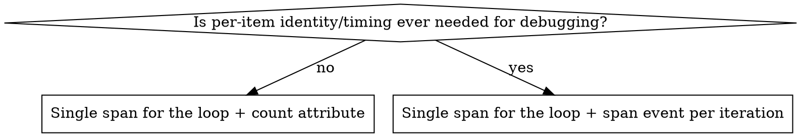

# Tracing hygiene patterns (Go / OpenTelemetry)

## Pattern 1: span created inside a loop

**Symptom:** `tracer.Start(...)` (or equivalent) called once per loop iteration —
per block, per shard, per record, per retry. A tenant/request with a lot of
items turns one trace into hundreds or thousands of spans, which is unusable
to query or view. See Tempo's own instrumentation best practices: "adding a
span for each method or function call in that loop might... produce hundreds
or thousands of worthless spans."

**Real example** (`grafana/tempo`, `modules/livestore/instance_search.go`,
`iterateBlocks`): a span was started inside `go func(block common.WALBlock) {
... tracer.Start(ctx, "process.walBlock") ...}` for every wal block and every
complete block in a tenant's block list.

### Decision: what replaces the per-iteration span?



- **No per-item value** (the loop body is uniform, failures are already
  attributed via a wrapped error): collapse to one span around the loop,
  record only a count attribute (e.g. `attribute.Int("blocksProcessed", n)`).
- **Per-item value still matters** (you'd otherwise want to see which item,
  and roughly when, within the loop): keep one span around the loop, but
  replace each per-iteration span with `span.AddEvent("processed block",
  trace.WithAttributes(attribute.String("blockID", meta.BlockID.String())))`.
  Events are timestamped and queryable (`{ event:name = "processed block" }`,
  `{ event.blockID = "..." }`) without the overhead of a full child span.

Do not silently default to the count-only version when the per-item ID was
being used for anything (error attribution, latency-outlier hunting) — check
how the removed span's attributes were actually consumed before dropping
them.

### Before / after

```go
// before
for _, b := range snap.walBlocks {
    ...
    go func(block common.WALBlock) {
        ctx, span := tracer.Start(ctx, "process.walBlock")
        span.SetAttributes(attribute.String("blockID", meta.BlockID.String()))
        defer span.End()
        if err := fn(ctx, meta, block); err != nil { handleErr(...) }
    }(b)
}

// after (per-item identity still useful -> span event on the parent span)
for _, b := range snap.walBlocks {
    ...
    go func(block common.WALBlock) {
        if err := fn(ctx, meta, block); err != nil {
            span.AddEvent("wal block failed", trace.WithAttributes(
                attribute.String("blockID", meta.BlockID.String())))
            handleErr(...)
            return
        }
        span.AddEvent("wal block processed", trace.WithAttributes(
            attribute.String("blockID", meta.BlockID.String())))
    }(b)
}
```

`span` here is the single span already started around the whole
`iterateBlocks` call — nothing new is started per iteration.

## Pattern 2: span never marked as errored

**Symptom:** a function that creates a span can return a non-nil error on
some path, but nothing ever calls `span.SetStatus(codes.Error, ...)` for that
path. The span (and the trace) reads as successful even though the operation
failed. In one real codebase audit, spans were started (`defer span.End()`)
at 161 call sites but `SetStatus(codes.Error, ...)` was only called at 19 —
most error paths leave no trace-level error signal at all.

A related half-fix: some call sites call `span.RecordError(err)` but never
`SetStatus`. `RecordError` only attaches an exception event; it does not
change the span's status. A `{ status = error }` TraceQL query, an
error-rate dashboard, or an automated investigation (Sift, or an LLM agent
doing root-cause analysis over traces) will not see that span as an error
unless `SetStatus` is also called. Conversely, always set `codes.Ok`
explicitly on the success path too — leaving status `Unset` on success makes
"no error" and "nobody checked" indistinguishable.

### The fix: one deferred call, not per-return-site edits

Don't add `span.SetStatus(...)` at every individual `return err` — that's
easy to miss on a new return path later, and touches every branch of the
function. Instead, capture the error once via a defer right after the span
is created, using the reference helper (`error-helper.go` in this skill):

```go
// before
func (s *BackendScheduler) loadWorkCacheFromBackend(ctx context.Context) error {
    ctx, span := tracer.Start(ctx, "loadWorkCacheFromBackend")
    defer span.End()

    reader, _, err := s.reader.Read(ctx, backend.WorkFileName, backend.KeyPath{}, nil)
    if err != nil {
        return err
    }
    ...
}

// after
func (s *BackendScheduler) loadWorkCacheFromBackend(ctx context.Context) (err error) {
    ctx, span := tracer.Start(ctx, "loadWorkCacheFromBackend")
    defer func() { tracing.RecordErr(span, err); span.End() }()

    reader, _, err := s.reader.Read(ctx, backend.WorkFileName, backend.KeyPath{}, nil)
    if err != nil {
        return err
    }
    ...
}
```

### Watch for shadowing when introducing the named return

The function must return through the *same* `err` variable the defer closes
over. If `err` is currently declared fresh inside a nested block (`if resp,
err := doThing(); err != nil { ... }`), converting the function to a named
return does not automatically fix that — the inner `err` still shadows the
outer one unless it's in the same scope as the function-level declaration,
or the return statement explicitly assigns the named `err` before returning.
Check this before assuming the mechanical rewrite is safe; when it isn't
safe to do without touching control flow, skip and flag the function for
manual review rather than restructuring it.
